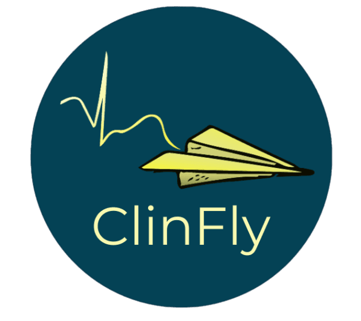

# ClinFly




Contact : [kevin.yauy@chu-montpellier.fr](mailto:kevin.yauy@chu-montpellier.fr)

## Introduction

ClinFly is an automated framework designed to facilitate precision medicine (PM) for rare diseases. It addresses the challenge of precision phenotyping and data sharing across different languages.

ClinFly can anonymize, translate, and summarize clinical reports using Human Phenotype Ontology (HPO) terms, ensuring compliance with medical data privacy standards. The output includes a de-identified translated clinical report and a summary report in HPO format.

By streamlining the translation and anonymization of clinical reports, ClinFly aims to enhance inter-hospital data sharing, expedite medical discoveries, and pave the way for an international patient file accessible to non-English speakers.

## Pipeline 


## Installation

To install ClinFly on your local machine, you need the `poetry` package manager. Navigate to the project folder and run:

```
poetry install
```

You'll need poppler installed in your os to use OCR on pdf file (https://pdf2image.readthedocs.io/en/latest/installation.html)

If you need to generate a `requirements.txt` file, use the following command:
```
poetry export --without-hashes --format=requirements.txt > requirements.txt
```

## Usage

### Graphical User Interface 

For single report usage with interactive analysis, ClinFly provides a web application accessible at https://huggingface.co/spaces/kyauy/ClinFly.

To run the Streamlit application on your local computer, activate the poetry shell and run the `clinfly_app_st.py` file:
```
poetry shell
streamlit run clinfly_app_st.py
```

### Command Line Interface

For processing multiple reports with offline options, use the command line interface provided by `clinfly_app_cli.py`.

The input should be a TSV .tsv file structured as follows (see `data/test.tsv` for an example):
```
Report_id_1   Doe  John  Report text 
...
Report_id_X   Doe  John  Report text
```
You can also put a symlink to a pdf file (see `data/test_pdf.tsv` for an example)
```
Report_id_X   Doe  John  Example.pdf
```

Outputs will be placed in the `results` folder according to the file extension, using first three columns in filename. 
- The deidentify report will be generated and placed in the `results/Reports` folder.
- Three HPO extraction outputs will be generated in `TSV`, `TXT` and `JSON` folders.

To run the CLI application on your local computer :
```
poetry shell
<python running version> clinfly_app_cli.py --file <input txt file with the reports> --language <language of the file> --model_dir <The output directory of the model (OPTIONAL)> --result_dir <The output directory of the generated result (OPTIONAL)>
```


## Acknoledgments and reference

ClinFly is a tool developed by University Hospital of Montpellier and Hospices Civils de Lyon. Thanks to the developers, especially Enody Gernet for his contribution. 

If you use ClinFly, please cite:
> Gauthier et al., Assessing feasibility and risk to translate, de-identify and summarize medical letters using deep learning. medrXiv (2023). [https://doi.org/10.1101/2023.07.27.23293234](https://doi.org/10.1101/2023.07.27.23293234)